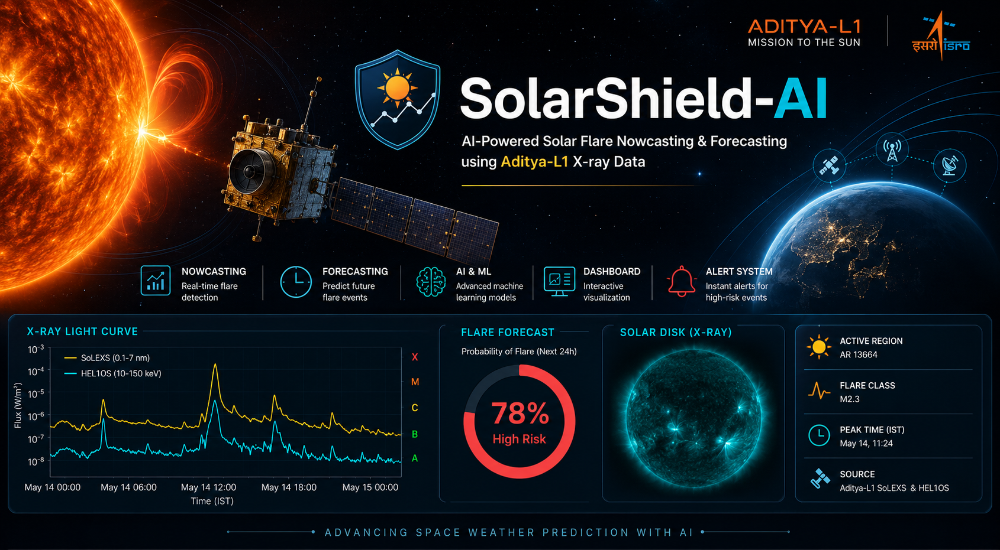

# SolarShield AI

<p align="center">

</p>


<div align="center">

# ☀️ SolarShield-AI

### AI-Powered Solar Flare Nowcasting & Forecasting using Aditya-L1 X-ray Data

[]()
[]()

</div>

---

## 📖 Project Overview

SolarShield-AI is an AI-powered space weather prediction system developed to detect and forecast solar flares using X-ray observations from ISRO's Aditya-L1 mission.

The project combines solar physics, machine learning, and time-series analysis to build an intelligent early warning system capable of identifying potential solar flare events before they impact satellites, communication systems, GPS navigation, and power infrastructure.

---

## 🎯 Problem Statement

Solar flares are sudden bursts of energy released from the Sun due to magnetic reconnection. These events can disrupt satellite communication, navigation systems, radio signals, and power grids on Earth.

The objective of this project is to develop an AI-based automated pipeline that can detect and forecast solar flares using combined SoLEXS and HEL1OS X-ray data from ISRO's Aditya-L1 mission.

---

## 🚀 Objectives

- Detect solar flares in real time (Nowcasting)
- Forecast future solar flare events using AI models
- Analyze combined SoLEXS and HEL1OS X-ray data
- Develop an interactive visualization dashboard
- Generate automated early warning alerts
- Support future space weather monitoring applications

---

## 🏗️ System Architecture
                 Aditya-L1 Data
           (SoLEXS + HEL1OS)
                       │
                       ▼
              Data Collection
                       │
                       ▼
              Data Processing
      (Cleaning + Synchronization)
                       │
                       ▼
            Feature Engineering
                       │
                       ▼
             ML Prediction Model
                       │
             ┌─────────┴─────────┐
             ▼                   ▼
       Flare Detection      Flare Forecast
       (Nowcasting)         (Forecasting)
             │                   │
             └─────────┬─────────┘
                       ▼
                 Alert System
                       │
                       ▼
             Dashboard & Reports
---

## 🛠️ Tech Stack

- Python
- NumPy
- Pandas
- Matplotlib
- Scikit-learn
- TensorFlow / PyTorch
- Jupyter Notebook
- Streamlit
- Git & GitHub

---

## 📂 Project Structure

```text
SolarShield-AI
│
├── 📁 data/          # Raw & processed datasets
├── 📁 dashboard/     # Streamlit dashboard
├── 📁 docs/          # Documentation
├── 📁 images/        # Images & diagrams
├── 📁 models/        # Trained AI models
├── 📁 notebooks/     # Jupyter notebooks
├── 📁 outputs/       # Predictions & results
├── 📁 src/           # Source code
├── 📄 requirements.txt
└── 📄 README.md
```


## 🔄 Workflow

Aditya-L1 X-ray Data

↓

Data Collection

↓

Data Preprocessing

↓

Feature Engineering

↓

Machine Learning Model

↓

Solar Flare Detection & Forecasting

↓

Interactive Dashboard

↓

Alert Generation

---

## 🤖 AI Model

---

## 📊 Dashboard Preview

---

## 📈 Results

---


## 🔮 Future Scope

- Real-time space weather monitoring
- Integration with live Aditya-L1 data streams
- Advanced deep learning forecasting models
- Multi-satellite data fusion
- Mobile and web-based alert systems
- Research and educational applications

---

## 👨‍💻 Team

This project is being developed as part of the Bharatiya Antariksh Hackathon 2026.

>Krishnanand (Lead + Research)

>Shambhavi (ML Engineer)

>Khushi (Python + Data Processing)


---


## 🙏 Acknowledgements