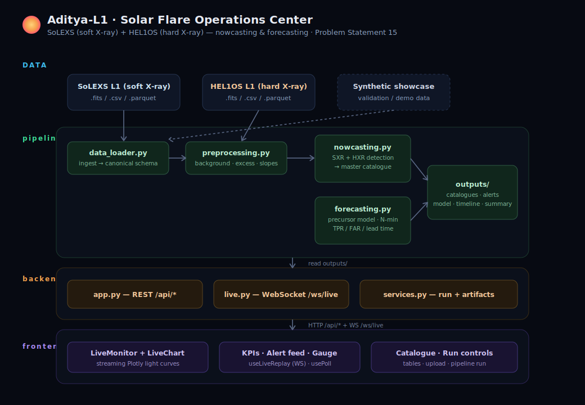

# Aditya-L1 · Solar Flare Operations Center

**Problem Statement 15 — Forecasting and/or Nowcasting of Solar Flares using
combined Soft and Hard X-ray data from Aditya-L1 (SoLEXS + HEL1OS).**

A full-stack application that ingests SoLEXS (soft X-ray) and HEL1OS (hard X-ray)
light curves, **nowcasts** flares in real time, **forecasts** flare probability
with a quantifiable lead time, and presents everything in a **live mission-control
dashboard** with visual alerts.



---

## Table of contents

1. [Quick start (Windows — step by step)](#1-quick-start-windows--step-by-step)
   · [Setup on another laptop (ZIP / GitHub)](#setting-up-on-another-laptop-share-via-zip-or-github)
2. [What the dashboard shows](#2-what-the-dashboard-shows)
3. [Architecture](#3-architecture)
4. [How the pipeline works (the science)](#4-how-the-pipeline-works-the-science)
5. [Backend (web) — how it works](#5-backend-web--how-it-works)
6. [Frontend — how it works](#6-frontend--how-it-works)
7. [End-to-end workflow](#7-end-to-end-workflow)
8. [File-by-file reference](#8-file-by-file-reference)
9. [Using real ISSDC / PRADAN data](#9-using-real-issdc--pradan-data)
10. [What is implemented vs. what is left](#10-what-is-implemented-vs-what-is-left)
11. [For the next developer](#11-for-the-next-developer)
12. [Configuration reference](#12-configuration-reference)
13. [Troubleshooting](#13-troubleshooting)

---

## 1. Quick start (Windows — step by step)

Follow these steps in order. You only do steps 1–2 once; after that you just run
step 5 to start the app.

### Step 1 — Install Python (3.11 or newer)
- Download from **https://www.python.org/downloads/**.
- Run the installer and **tick the box "Add Python to PATH"** at the bottom of the
  first screen (this is important), then click **Install Now**.
- Check it worked: open the **Start menu**, type **PowerShell**, press Enter, and run:
  ```powershell
  python --version
  ```
  You should see something like `Python 3.11.x`.

### Step 2 — Install Node.js (18 or newer)
- Download the **LTS** version from **https://nodejs.org/**.
- Run the installer and click Next through all the steps (defaults are fine).
- Check it worked (in PowerShell):
  ```powershell
  node --version
  ```
  You should see something like `v20.x` or `v22.x`.

### Step 3 — Open this project folder in PowerShell
In PowerShell, "go into" the project folder with `cd` (change directory). Copy the
folder's full path from File Explorer's address bar and paste it in quotes:

```powershell
cd "C:\Users\<you>\...\aditya_l1_solar_flare_pipeline"
```

> Tip: in File Explorer you can also Shift + Right-click the project folder and choose
> **"Open in Terminal"** to land here automatically.

### Step 4 — Install the Python packages (one time)
```powershell
pip install -r requirements.txt
```
This downloads the libraries the project needs (NumPy, pandas, FastAPI, …). It runs
once; you don't repeat it unless `requirements.txt` changes.

### Step 5 — Start the app (this is the command you'll use every time)
```powershell
powershell -ExecutionPolicy Bypass -File scripts/start.ps1
```
**The first run takes a few minutes** because it automatically: runs the analysis
pipeline → installs the frontend packages → builds the dashboard → starts the server.
Later runs start in a few seconds.

When you see a line like `Uvicorn running on http://127.0.0.1:8000`, the app is ready.

### Step 6 — Open the dashboard
Open your browser and go to:

**http://127.0.0.1:8000**

To stop the app later, click in the PowerShell window and press **Ctrl + C**.

---

<details>
<summary><b>macOS / Linux users</b> (click to expand)</summary>

```bash
pip install -r requirements.txt
bash scripts/start.sh
```
Then open http://127.0.0.1:8000.
</details>

<details>
<summary><b>Developer mode with hot reload</b> (click to expand)</summary>

Run the API and the Vite dev server in two separate PowerShell windows:

```powershell
# Window 1 — API + WebSocket on port 8000
uvicorn backend.app:app --reload --port 8000

# Window 2 — UI dev server on port 5173
cd frontend
npm install
npm run dev
```
Open http://localhost:5173 — Vite forwards `/api` and `/ws` to the backend.
(On a corporate/TLS-inspected network, if `npm install` fails with
`UNABLE_TO_VERIFY_LEAF_SIGNATURE`, run `scripts/start.ps1` once first to create the
CA bundle, or see [§13 Troubleshooting](#13-troubleshooting).)
</details>

### Setting up on another laptop (share via ZIP or GitHub)

**Both ways need the same two tools installed first:** Python 3.11+ and Node 18+.
Check with `python --version` and `node --version`. Nothing else is installed by
hand — the start script does the rest (runs the pipeline, builds the UI, starts the
server).

#### Option A — GitHub (recommended, smallest & cleanest)

The **sender** publishes the repo once:

```bash
git init
git add -A
git commit -m "Aditya-L1 solar flare operations center"
git branch -M main
git remote add origin <your-repo-url>
git push -u origin main
```

`.gitignore` already excludes the heavy/private stuff (`node_modules`, `dist`,
`outputs/*`, processed data, and the CA bundle), so the pushed repo stays small.

The **receiver** clones and launches:

```bash
git clone <your-repo-url>
cd aditya_l1_solar_flare_pipeline
pip install -r requirements.txt
# Windows:
powershell -ExecutionPolicy Bypass -File scripts/start.ps1
# macOS / Linux:
bash scripts/start.sh
```

First launch auto-generates the outputs and builds the UI, then serves
**http://127.0.0.1:8000**.

#### Option B — ZIP file

**Sender — clean these folders BEFORE zipping** (they are large, machine-specific, or
private, and all get regenerated on the other side):

- `frontend/node_modules/` — huge and OS-specific; must be reinstalled anyway
- `frontend/dist/` — rebuilt automatically
- `frontend/corp-ca-bundle.pem` — contains your organisation's certificates, **don't share**
- `outputs/*`, `data/processed/*`, and any `__pycache__/` — all regenerated

PowerShell clean-up before zipping:

```powershell
Remove-Item -Recurse -Force frontend/node_modules, frontend/dist, frontend/corp-ca-bundle.pem -ErrorAction SilentlyContinue
Get-ChildItem -Recurse -Directory -Filter __pycache__ | Remove-Item -Recurse -Force
```

**Receiver** — unzip, then run the *same* steps as the GitHub receiver above
(`pip install -r requirements.txt`, then the start script).

> If you zip **without** cleaning, it still runs on the **same** operating system, but
> the file will be ~200 MB+ and the bundled `node_modules` may fail on a different OS.
> Cleaning first is strongly recommended.

### About the `frontend/corp-ca-bundle.pem` certificate file

You may notice this file appears inside `frontend/` after you first build the app.
Here is what it is and what other people should do about it.

- **What it is:** office networks often run "TLS inspection" (a security proxy that
  intercepts HTTPS). On such a network, `npm install` fails with
  `UNABLE_TO_VERIFY_LEAF_SIGNATURE` because Node doesn't trust the proxy's
  certificate. To fix this **securely**, `scripts/start.ps1` exports the certificates
  your Windows already trusts (including the office proxy's) into this file and tells
  Node to trust them. **Nothing is disabled** — it just teaches Node about certificates
  your computer already trusts.
- **It is personal to your machine.** It is git-ignored and is **never shared** — not
  on GitHub, and you delete it before making a ZIP (see Option B above).
- **What someone else does:**
  | Their situation | What they do |
  |---|---|
  | Normal / home network (most people) | Nothing — `npm install` just works; this file isn't needed. |
  | Office / inspected network, **Windows** | Nothing manual — `scripts/start.ps1` automatically creates a **fresh** bundle from *their own* machine on first build. Each person gets their own. |
  | Office / inspected network, **macOS/Linux** | Set `NODE_EXTRA_CA_CERTS` to their system CA file before building, or as a last resort run `npm config set strict-ssl false`. |

In short: **do not copy this file to anyone.** Each machine that needs one makes its
own automatically (on Windows) or doesn't need one at all (normal networks).

---

## 2. What the dashboard shows

- **Live X-ray Monitor** — SoLEXS soft X-ray, HEL1OS hard X-ray, and forecast
  probability stream through a WebSocket in accelerated time. The traces advance,
  nowcast detections light up as coloured event bands, and the forecast
  probability rises **before** each flare. Play / pause / restart, speed 1×–32×.
- **Live nowcast feed** — every detected flare appears as it fires, with class,
  status (confirmed / SXR-only / HXR-only), peak fluxes, and HXR→SXR lead minutes.
- **Forecast probability gauge** — current P(flare ≤ horizon); turns red and
  "armed" when it crosses the operating threshold.
- **KPI strip** — master events, confirmed coincidences, forecast alerts, and the
  walk-forward True-Positive Rate / False-Alarm Rate / median lead time / AUC.
- **Catalogue + forecast-alert tables**, **pipeline run controls**, **file upload**
  for real PRADAN data, and a link to the exported static Plotly dashboard.

---

## 3. Architecture

Three layers with **zero cross-contamination**:

```
pipeline/   the science only — no web code, no FastAPI imports
backend/    the web layer only — no science, just adapts pipeline outputs
frontend/   a standalone React app — talks to backend over HTTP + WebSocket
```

```
 SoLEXS L1 ┐
 HEL1OS L1 ├─► pipeline/ ──► outputs/ ──► backend/ ──HTTP /api──► frontend/
 synthetic ┘   (detect +      (CSV,        (FastAPI    ──WS /ws/live──►  (React live
                forecast)      model,        REST +                       dashboard)
                               dashboard)    WebSocket)
```

- **Why the split matters:** the science can be developed, tested, and run from the
  CLI with no web server; the web layer can evolve without touching detection/
  forecasting logic; the frontend is a normal npm project.
- **The contract between layers** is (a) the files in `outputs/`, and (b) one
  canonical in-memory schema: `time | sxr_flux | hxr_flux | sxr_quality | hxr_quality`.

### Tech stack

| Layer | Stack |
|---|---|
| Pipeline | Python, NumPy, pandas, scikit-learn, Astropy (FITS), Plotly, joblib |
| Backend | FastAPI, Uvicorn, WebSockets, pandas |
| Frontend | React 18, TypeScript, Vite, Tailwind CSS, Plotly.js |

---

## 4. How the pipeline works (the science)

Everything is driven by `pipeline/config.py` (single source of truth for paths,
column names, physical units, and tunable thresholds).

### 4.1 Ingestion → canonical schema (`data_loader.py`)
Reads SoLEXS and HEL1OS files (FITS / CSV / Parquet), parses timestamps, selects
or sums signal channels, preserves quality flags, merges the two payloads on time,
resamples to a common cadence, interpolates short gaps, and returns **one
DataFrame** with columns:

```
time | sxr_flux (W/m²) | hxr_flux (counts/s) | sxr_quality | hxr_quality
```

After this point, nothing downstream knows or cares whether the source was real
FITS data or the synthetic showcase.

### 4.2 Preprocessing (`preprocessing.py`)
Adds derived columns used by both detection and forecasting: smoothed signals,
rolling quiet-Sun **background**, **excess** above background, **ratios**,
**slopes** (per-minute trend), and short-window volatility.

### 4.3 Nowcasting / detection (`nowcasting.py`)
- **SXR detector** — triggers when smoothed soft X-ray exceeds background by
  `SXR_RISE_THRESHOLD_RATIO`; records onset / peak / end and assigns a GOES-style
  class (A/B/C/M/X) from `peak_sxr_flux_w_m2`.
- **HXR detector** — triggers when hard X-ray excess exceeds
  `HXR_RISE_THRESHOLD_SIGMA` × noise.
- **Master catalogue** — matches SXR and HXR peaks within `COINCIDENCE_WINDOW_MIN`:
  `confirmed` (both channels), `sxr_only` (thermal), `hxr_only` (impulsive), and
  reports how many minutes HXR **leads** SXR (impulsive precedes thermal in real
  flares — the Neupert effect).

### 4.4 Forecasting (`forecasting.py`)
- **Features** — over a sliding `LOOKBACK_WINDOW_MIN` window: SXR/HXR mean, std,
  max, slope, max-jump, microburst counts, background ratios, and the SXR–HXR
  cross-correlation.
- **Label** — positive if a qualifying (≥ `MIN_FLARE_CLASS_FOR_POSITIVE`, default
  C-class) flare onset occurs within the next `FORECAST_HORIZON_MIN` minutes.
- **Model** — `HistGradientBoostingClassifier`, trained on a **chronological**
  split (no leakage).
- **Evaluation** — **walk-forward** folds produce honest True-Positive Rate,
  False-Alarm Rate, and lead-time distributions. Alerts are **debounced** so one
  elevated-probability episode is one alert, not one per sample.

### 4.5 Outputs (`outputs/`)

| File | Produced by | Contents |
|---|---|---|
| `nowcast_master_catalogue.csv` | nowcasting | combined SXR+HXR flare catalogue |
| `nowcast_sxr_events.csv` / `nowcast_hxr_events.csv` | nowcasting | per-channel detections |
| `forecast_alerts.csv` | forecasting | debounced alert episodes (test period) |
| `forecast_probabilities.csv` | forecasting | per-window probability (test period) |
| `forecast_timeline.csv` | forecasting | **full-timeline** probability (drives the live trace) |
| `forecaster_model.joblib` | forecasting | trained model |
| `dashboard.html` | dashboard | self-contained static Plotly export |
| `pipeline_summary.txt` | run_pipeline | human-readable metrics (parsed by the API) |

---

## 5. Backend (web) — how it works

FastAPI app in `backend/app.py`. It contains **no science** — it triggers pipeline
runs, serves the generated artifacts as JSON, and streams the live replay.

### REST API

| Method · Path | Purpose |
|---|---|
| `GET /api/health` | service heartbeat + version |
| `GET /api/metrics` | parsed KPIs (events, TPR, FAR, lead, AUC) |
| `GET /api/catalogue` | master + per-channel catalogues |
| `GET /api/alerts` | forecast alert episodes |
| `GET /api/forecast-timeline` | full-timeline forecast probability (downsampled; for external/future use — the live UI gets probability via the WebSocket) |
| `GET /api/light-curve` | downsampled light curve for plotting |
| `GET /api/summary` | `pipeline_summary.txt` |
| `GET /api/files` | raw payload file inventory |
| `POST /api/run` | start a `real` or `synthetic` run (background thread) |
| `GET /api/run-status` | current/last run status + captured log |
| `POST /api/upload/{solexs\|hel1os}` | upload a raw payload file |
| `GET /api/dashboard` | the static Plotly export |
| `WS /ws/live` | **live replay stream** |

### The live replay (`backend/live.py`)
Real L1 data is not a live stream on a laptop, so the WebSocket **replays the
already-processed light curve in accelerated time**. On connect it sends an `init`
message (time bounds, threshold, full event list, GOES class thresholds), then
streams batches of points as `frame` messages, attaching any flare events whose
onset falls in that batch (`fired_events`). The client controls it with
`pause` / `resume` / `restart` / `speed` messages. This is what makes the demo feel
like a real operations console watching a downlink.

---

## 6. Frontend — how it works

Standard Vite + React + TypeScript app in `frontend/`.

- **`useLiveReplay` hook** — owns the WebSocket. It pushes incoming points
  *imperatively* into the Plotly chart (via a ref) to avoid React re-render storms
  at 30 Hz, while exposing throttled state (status, progress, latest values,
  fired-alert list) for the surrounding UI.
- **`LiveChart` component** — an imperative Plotly wrapper. `init()` builds the 3
  stacked panels (SXR log / HXR log / probability), `pushFrame()` appends points
  with `Plotly.extendTraces`, and event bands + a moving "now" cursor are drawn as
  layout shapes.
- **`usePoll` hook** — periodically refetches REST data so KPIs and tables stay
  current and refresh after a pipeline run completes. `App.tsx` polls `/api/metrics`
  (4 s), `/api/catalogue` (6 s), `/api/alerts` (6 s), `/api/run-status` (3 s),
  `/api/files` (10 s), and fetches `/api/summary` + `/api/health` once.
- **Live values vs. polled values:** the streaming SXR/HXR/probability traces and the
  fired-alert feed come from the **WebSocket**; the KPI numbers and the catalogue/
  alert tables come from the **polled REST endpoints**. (The `/api/forecast-timeline`
  endpoint exists for external consumers but the dashboard does not call it.)
- **State flow** — `App.tsx` wires the live hook to the chart ref and distributes
  live + polled state to the presentational components.

In **production** the backend serves `frontend/dist`. In **development** Vite serves
the app and proxies `/api` + `/ws` to the backend, so the same relative URLs work
in both modes.

---

## 7. End-to-end workflow

```
1. Data lands           data/raw/solexs, data/raw/hel1os   (or synthetic showcase)
2. Run pipeline         python -m pipeline.run_pipeline --source {real|synthetic}
      load → preprocess → nowcast → forecast → dashboard → write outputs/
3. Start server         uvicorn backend.app:app  (serves API + WS + built UI)
4. Dashboard            REST polls show catalogues/metrics; WS streams the live replay
5. Trigger a new run    from the UI "Run" buttons → backend reruns the pipeline →
                        artifacts refresh and the live feed reconnects to new data
```

---

## 8. File-by-file reference

### Root
| Path | What it is |
|---|---|
| `README.md` | this document |
| `requirements.txt` | Python dependencies |
| `.gitignore` | ignores caches, `node_modules`, build output, raw/processed data, outputs |
| `scripts/start.ps1` · `scripts/start.sh` | one-command demo launchers. `start.ps1` also auto-exports the corporate CA bundle so `npm` works on TLS-inspected networks |
| `docs/architecture.svg` | the architecture diagram shown above |

### `pipeline/` — the science (no web code)
| File | Responsibility |
|---|---|
| `__init__.py` | marks the package; exposes version |
| `config.py` | **single source of truth** — paths, schema, column candidates, units, all thresholds |
| `data_loader.py` | read FITS/CSV/Parquet → clean → merge SXR+HXR → canonical schema; saves processed real data |
| `synthetic_data.py` | generate the synthetic showcase light curve + ground-truth flare catalogue |
| `preprocessing.py` | background, smoothing, excess, ratios, slopes, volatility → feature frame |
| `nowcasting.py` | SXR + HXR detectors and the combined master catalogue |
| `forecasting.py` | sliding-window features, labels, train, walk-forward eval, alert catalogue, full-timeline scoring |
| `dashboard.py` | self-contained static Plotly HTML export (`outputs/dashboard.html`) |
| `inspect_real_data.py` | print columns/rows of real files to help configure ingestion |
| `run_pipeline.py` | end-to-end entry point; writes everything to `outputs/` |

### `backend/` — the web layer (no science)
| File | Responsibility |
|---|---|
| `__init__.py` | marks the package |
| `app.py` | FastAPI app: all REST routes, the `/ws/live` WebSocket, static SPA hosting |
| `services.py` | run orchestration (background thread + status/log), artifact readers, metrics parsing, light-curve loading/downsampling, uploads |
| `live.py` | the WebSocket live-replay engine (prepare frames, stream, handle controls) |

### `frontend/` — the React app
| Path | Responsibility |
|---|---|
| `index.html`, `src/main.tsx` | app entry |
| `public/sun.svg` | favicon / logo |
| `src/App.tsx` | layout + wiring of live hook ↔ chart ↔ polled data |
| `src/index.css` | Tailwind layers + component classes (`.panel`, `.btn`, …) |
| `src/api/client.ts` | typed REST fetchers + WebSocket URL helper |
| `src/api/types.ts` | TypeScript types mirroring backend payloads |
| `src/hooks/useLiveReplay.ts` | WebSocket lifecycle, controls, throttled state |
| `src/hooks/usePoll.ts` | generic interval polling for REST data |
| `src/lib/format.ts` | time/number/colour formatting helpers |
| `src/components/LiveChart.tsx` | imperative Plotly chart (extendTraces, shapes) |
| `src/components/LiveMonitor.tsx` | chart + transport controls + alert flash |
| `src/components/KpiStrip.tsx` | KPI cards |
| `src/components/ForecastGauge.tsx` | live probability gauge / armed state |
| `src/components/AlertFeed.tsx` | live list of fired nowcast detections |
| `src/components/CatalogueTable.tsx` | catalogue + forecast-alert tables (tabbed) |
| `src/components/RunControls.tsx` | run buttons, file upload, run log |
| `src/components/SummaryPanel.tsx` | collapsible pipeline summary |
| `src/components/TopBar.tsx` | header, live status, replay clock |
| `vite.config.ts`, `tailwind.config.js`, `postcss.config.js`, `tsconfig.json` | build/tooling config |

### `data/` and `outputs/`
| Path | What it is |
|---|---|
| `data/raw/solexs`, `data/raw/hel1os` | drop real PRADAN L1 files here |
| `data/processed/` | cleaned/merged real light curve (auto-written) |
| `data/external/` | optional real flare catalogue for labels (`flare_catalogue.csv`) |
| `data/sample/` | synthetic showcase light curve + ground truth |
| `outputs/` | all generated artifacts (catalogues, model, dashboard, summary) |

---

## 9. Using real ISSDC / PRADAN data

1. Download SoLEXS L1 and HEL1OS L1 products from the ISSDC PRADAN portal.
2. Place them in `data/raw/solexs/` and `data/raw/hel1os/` (or upload via the UI).
   Supported: `.fits .fit .fts .csv .parquet`.
3. Inspect the payload columns:
   ```bash
   python -m pipeline.inspect_real_data
   ```
4. If column names / time units differ, adjust the candidates in `pipeline/config.py`
   (`TIME_COLUMN_CANDIDATES`, `SOLEXS_SIGNAL_COLUMN_CANDIDATES`,
   `HEL1OS_SIGNAL_COLUMN_CANDIDATES`, `REAL_TIME_NUMERIC_UNIT`, …).
5. Run `python -m pipeline.run_pipeline --source real`.

Because the loader returns the canonical schema, **no other code (pipeline or UI)
changes** when switching from synthetic to real data.

---

## 10. What is implemented vs. what is left

### ✅ Implemented
- Real-data-first ingestion for FITS/CSV/Parquet with cleaning, merge, resample.
- Synthetic showcase generator with realistic A–X flares (validation/demo).
- Independent SXR and HXR detectors + combined master catalogue with HXR-lead.
- GOES-style flare classification.
- Forecasting model with chronological training and **walk-forward** TPR/FAR/lead.
- Debounced alert catalogue + full-timeline probability scoring.
- Static Plotly dashboard export.
- FastAPI backend: REST + uploads + background runs + **live WebSocket replay**.
- Professional React/Vite/Tailwind/Plotly live dashboard with transport controls.
- One-command launchers (with automatic corporate-CA handling for `npm`), refreshed
  architecture diagram, and this documentation.
- **Verified end-to-end:** every REST endpoint returns 200, the static SPA + hashed
  assets serve correctly, and the `/ws/live` WebSocket streams 3,002 frames + 76
  events on the synthetic showcase.

### ⬜ Left / not done yet (and exactly how to do each one)

These are honest gaps. For each one, here is **what is missing**, **which files/
folders to touch**, and **the steps** — in plain language.

#### 1. Validate and calibrate on REAL Aditya-L1 data  *(most important)*
- **Why:** every number in this README is from synthetic data. The detectors and the
  GOES flux→class mapping are only correct once tuned to real SoLEXS units.
- **Where:** `pipeline/config.py` (thresholds + units), `pipeline/data_loader.py`
  (if flux needs scaling).
- **Steps:** follow the calibration checklist in §11. In short: drop real files in
  `data/raw/`, run `python -m pipeline.inspect_real_data`, fix the column/time
  settings, run `--source real`, compare the catalogue to known flares, tune
  thresholds.

#### 2. True live ingestion (instead of replaying a finished file)
- **Why:** today the "live" view *replays* an already-processed light curve. A real
  console would watch for new L1 files and detect on the fly.
- **Where:** new file e.g. `pipeline/streaming.py` (incremental detection), and
  `backend/live.py` (stream the new data instead of a pre-baked replay).
- **Steps:** (a) write a function that, given the last processed timestamp, loads only
  newer raw data and runs `preprocessing` + `nowcasting` on the tail; (b) have
  `backend/live.py` call it on a timer and push real new points over the same
  WebSocket message format — the frontend needs **no change** because the message
  shape stays the same.

#### 3. Store catalogues in a database (not overwrite CSVs)
- **Why:** each run overwrites `outputs/*.csv`, so history is lost and events can be
  duplicated across runs.
- **Where:** new file `backend/store.py` (or `pipeline/store.py`), plus small edits in
  `pipeline/nowcasting.py` (write events) and `backend/services.py` (read events).
- **Steps:** add SQLite (Python's built-in `sqlite3`, no new dependency). On each run,
  insert events with a unique key (onset time + class) and `INSERT OR IGNORE` to
  dedupe. Point the API readers at the DB instead of the CSV.

#### 4. Make the forecasting model stronger
- **Why:** it is a single gradient-boosting model with hand-made features.
- **Where:** `pipeline/forecasting.py` only.
- **Steps:** add features inside `build_sliding_window_features()`; try probability
  calibration (`sklearn.calibration.CalibratedClassifierCV`); handle class imbalance;
  optionally forecast each flare class separately. Keep the **chronological** split —
  never shuffle (see §11 warnings).

#### 5. Real-time notifications (email / SMS / Slack)
- **Why:** alerts only show in the UI; no outbound notification.
- **Where:** new file `backend/notify.py`, called from `backend/live.py` when a
  forecast crossing or a confirmed nowcast fires.
- **Steps:** add a function that posts to a Slack webhook or sends email; debounce so
  one episode = one message (mirror the logic already in `forecasting.py`).

#### 6. Authentication & multi-user / deployment hardening
- **Why:** no login; one global run-state; single process.
- **Where:** `backend/app.py` (add auth middleware), deployment config (Dockerfile /
  reverse proxy) — none exists yet.
- **Steps:** add an API key or OAuth dependency to the routers; containerise with a
  Dockerfile that runs `npm run build` then `uvicorn`.

#### 7. Automated tests
- **Why:** there is no test suite.
- **Where:** new `tests/` folder.
- **Steps:** add `pytest` tests for `data_loader` (schema), `nowcasting` (known
  injected flare is detected), `forecasting` (no future leakage), and a FastAPI
  `TestClient` test that hits each endpoint and the WebSocket.

---

## 11. For the next developer

### Mental model
- Treat `pipeline/config.py` as the control panel. Almost everything tunable lives
  there; avoid hard-coding values elsewhere.
- The boundary between layers is `outputs/` + the canonical schema. Keep science out
  of `backend/` and web concerns out of `pipeline/`.

### Where to make common changes
| You want to… | Edit |
|---|---|
| Change detection sensitivity | `SXR_RISE_THRESHOLD_RATIO`, `HXR_RISE_THRESHOLD_SIGMA` in `config.py` |
| Change forecast horizon / lookback | `FORECAST_HORIZON_MIN`, `LOOKBACK_WINDOW_MIN` |
| Change alert threshold | `ALERT_PROBABILITY_THRESHOLD` |
| Add a forecasting feature | `build_sliding_window_features()` in `forecasting.py` |
| Add an API endpoint | `backend/app.py` (+ a reader in `services.py`) |
| Change the live stream shape | `backend/live.py` + `useLiveReplay.ts` + `LiveChart.tsx` |
| Restyle the UI | Tailwind classes / `src/index.css` / `tailwind.config.js` |

### Real-data calibration checklist
1. `python -m pipeline.inspect_real_data` → confirm column names + time format.
2. Set `REAL_TIME_NUMERIC_UNIT` / `REAL_TIME_ORIGIN` if time is numeric mission time.
3. Confirm SoLEXS flux units. **If it is not GOES-equivalent W/m², recalibrate
   `FLARE_CLASS_THRESHOLDS`** or scale the flux in the loader.
4. Pick the right HEL1OS count-rate channel(s).
5. Run `--source real`, inspect `data/processed/real_light_curve_standardized.parquet`.
6. Compare `nowcast_master_catalogue.csv` against known/official flare lists.
7. Tune thresholds; re-check TPR / FAR / lead time in `pipeline_summary.txt`.
8. Optionally add `data/external/flare_catalogue.csv` (`onset_time,class`) for
   stronger forecasting labels than self-labelling from nowcasts.

### ⚠️ Notes & warnings (read before editing)
- **No data leakage (critical for a science project):** the train/validation/test
  split is **by time**, never random. If you shuffle the time series you will leak the
  future into the past and your accuracy numbers become fake. Keep
  `chronological_split()` in `forecasting.py` as-is.
- **Quality flags matter:** the `sxr_quality` / `hxr_quality` columns mark
  interpolated or missing samples (0 = good, 1 = flagged). Respect them when you add
  features; don't treat filled gaps as real measurements.
- **Live chart performance:** `LiveChart.tsx` updates Plotly *imperatively*
  (`extendTraces`) on purpose. Do **not** move per-frame point arrays into React
  state — at 30 frames/second that would freeze the browser.
- **Build before serving in production:** `frontend/dist` is git-ignored, so it does
  not exist until you run `npm run build`. The launcher does this for you; if you skip
  it, the page shows "Frontend has not been built yet."
- **Corporate network / npm:** on TLS-inspected networks `npm install` fails with
  `UNABLE_TO_VERIFY_LEAF_SIGNATURE`. The launcher fixes this automatically by trusting
  your machine's CA bundle (`frontend/corp-ca-bundle.pem`, git-ignored). See §13.

### 🚫 What you should NOT change (or change only very deliberately)
- **The canonical schema** `time | sxr_flux | hxr_flux | sxr_quality | hxr_quality`.
  It is the contract every layer depends on. If you rename or drop a column, the
  loader, preprocessing, nowcasting, forecasting, dashboard, backend, **and** frontend
  all break. Change it only if you update all of them together.
- **The layer boundaries.** Don't import `backend` from `pipeline`, and don't put
  detection/forecasting maths into `backend/`. The science must run from the CLI with
  no web server. Keep web code out of `pipeline/`.
- **The WebSocket message shapes** (`init` / `frame` / `reset` / `done`) in
  `backend/live.py` — they are mirrored by the TypeScript types in
  `frontend/src/api/types.ts` and the chart logic. If you change one side, change the
  other in the same commit.
- **`pipeline/config.py` as the single source of truth.** Don't hard-code paths,
  column names, units, or thresholds anywhere else — add them here and import them.
- **The relative API/WS URLs** in the frontend (`/api/...`, `/ws/live`). They are what
  let the same build work in both dev (Vite proxy) and production (same origin). Don't
  hard-code `localhost:8000`.
- **Auto-generated / local-only files:** `frontend/node_modules`, `frontend/dist`,
  `outputs/*`, `data/processed/*`, `frontend/corp-ca-bundle.pem`. These are produced by
  tools and are git-ignored — don't edit by hand or commit them.

---

## 12. Configuration reference

Key knobs in `pipeline/config.py`:

| Setting | Meaning |
|---|---|
| `USE_SYNTHETIC` | default data source (CLI `--source` overrides) |
| `RESAMPLE_CADENCE_S` | common cadence after merge |
| `BACKGROUND_WINDOW_MIN`, `BACKGROUND_PERCENTILE` | quiet-Sun background estimate |
| `SXR_RISE_THRESHOLD_RATIO` | SXR trigger sensitivity |
| `HXR_RISE_THRESHOLD_SIGMA` | HXR trigger sensitivity |
| `COINCIDENCE_WINDOW_MIN` | SXR↔HXR matching window for `confirmed` events |
| `FLARE_CLASS_THRESHOLDS` | GOES A/B/C/M/X flux boundaries |
| `FORECAST_HORIZON_MIN` | how far ahead to forecast |
| `LOOKBACK_WINDOW_MIN` | feature history length |
| `MIN_FLARE_CLASS_FOR_POSITIVE` | smallest class counted as a positive label |
| `ALERT_PROBABILITY_THRESHOLD` | operating point for alerts |
| `TRAIN_FRACTION`, `VAL_FRACTION` | chronological split sizes |

---

## 13. Troubleshooting

| Symptom | Cause & fix |
|---|---|
| `npm install` hangs forever / `UNABLE_TO_VERIFY_LEAF_SIGNATURE` | **Corporate TLS inspection** — the proxy's certificate isn't trusted by Node. The launcher fixes this automatically (exports your machine's trusted CAs to `frontend/corp-ca-bundle.pem` and sets `NODE_EXTRA_CA_CERTS`). To do it manually: `setx NODE_EXTRA_CA_CERTS <path-to-that-pem>` then reopen the shell, or as a last resort `npm config set strict-ssl false`. |
| `npm install` is just slow (no errors) | This folder is OneDrive-synced; npm writes many small files slowly. Let it finish once (the cache warms), or move the repo to a local, non-synced path. |
| Browser shows "Frontend has not been built yet" | `dist/` doesn't exist yet → `cd frontend && npm run build`, then restart the server (or use `npm run dev`). |
| Live monitor says "no data" | Run the pipeline first: UI "Run Synthetic", or `python -m pipeline.run_pipeline --source synthetic`. |
| Port 8000 "address already in use" | An old server is still running. Find and stop it (Windows: `Get-NetTCPConnection -LocalPort 8000`, then `Stop-Process -Id <pid>`), or start uvicorn on another port. |
| WebSocket won't connect in dev | The backend must be running on :8000; the Vite proxy targets `127.0.0.1:8000`. |
| Real data fails to parse time | Set `REAL_TIME_NUMERIC_UNIT` / `REAL_TIME_ORIGIN` in `pipeline/config.py`. |

---

## Synthetic showcase baseline

Bundled synthetic run (installation/workflow baseline — **real performance must be
measured on real Aditya-L1 data**):

| Metric | Value |
|---|---:|
| Samples | 1,209,600 |
| SXR detections | 74 |
| HXR detections | 56 |
| Master catalogue events | 76 |
| Confirmed events | 54 |
| Validation AUC | 0.957 |
| Test AUC | 0.807 |
| Walk-forward TPR | 84.6% |
| Walk-forward FAR | 39.2% |
| Median lead time | 15.2 min |
